

# Phishing Analysis Fundamentals

## What is Phishing?

Phishing is a type of social engineering attack in which an attacker impersonates a trusted organization or individual to trick victims into revealing sensitive information such as usernames, passwords, banking details, or personal data.

Attackers usually use fake emails, websites, SMS messages, or phone calls to deceive users.

Phishing attacks often create a sense of urgency, fear, or curiosity to manipulate victims into clicking malicious links or downloading harmful attachments.

## Types of Phishing

### 1. Email Phishing
The most common type of phishing where attackers send fraudulent emails
pretending to be from trusted organizations like banks, companies, or online services.

---

### 2. Spear Phishing
A targeted phishing attack aimed at a specific individual or organization.
The attacker customizes the message using personal information to make it more convincing.

---

### 3. Whaling
A type of spear phishing that targets high-profile individuals such as
CEOs, managers, or senior executives.

---

### 4. Smishing
Phishing conducted through SMS (text messages) to trick victims
into clicking malicious links or sharing sensitive information.

---

### 5. Vishing
Voice phishing carried out through phone calls where attackers
pretend to be legitimate representatives to steal information.

---

### 6. Clone Phishing
An attacker creates a duplicate of a legitimate email but replaces
links or attachments with malicious ones.

---

### 7. Pharming
Redirecting users from a legitimate website to a fake website
without their knowledge, often by manipulating DNS settings.

## What is SMTP (Simple Mail Transfer Protocol)?

SMTP (Simple Mail Transfer Protocol) is a standard communication protocol used to send emails over the Internet.

It is responsible for transferring outgoing email messages from a sender's email client to a mail server and between mail servers.

---

## How SMTP Works

1. The sender composes an email in an email client.
2. The email client sends the message to the SMTP server.
3. The SMTP server forwards the message to the recipient’s mail server.
4. The recipient retrieves the email using POP3 or IMAP.

---

## Default SMTP Ports

- Port 25 – Default SMTP port
- Port 587 – Secure email submission (TLS)
- Port 465 – SMTP over SSL

---

## Why SMTP is Important in Phishing Analysis

SOC analysts check SMTP headers to:

- Identify the sender’s IP address
- Detect spoofed domains
- Verify SPF, DKIM, and DMARC authentication
- Trace email relay paths

---

## What is POP3 (Post Office Protocol)?

POP3 (Post Office Protocol version 3) is an email retrieval protocol used to download emails from a mail server to a local device.

It allows users to access their emails offline after downloading them.

---

## How POP3 Works

1. The email client connects to the POP3 server.
2. The client authenticates using a username and password.
3. Emails are downloaded from the server to the local device.
4. By default, emails are deleted from the server after download (unless configured otherwise).

---

## Default POP3 Ports

- Port 110 – Default POP3 port
- Port 995 – POP3 over SSL (Secure POP3)

---

## Key Features of POP3

- Downloads emails to a single device
- Works offline after download
- Does not sync across multiple devices
- Limited folder management

---

## POP3 in Security Analysis

SOC analysts may check POP3 logs to:

- Detect suspicious login attempts
- Identify brute-force attacks
- Monitor unusual IP access patterns
- Investigate unauthorized mailbox access

---

## What is IMAP (Internet Message Access Protocol)?

IMAP (Internet Message Access Protocol) is an email retrieval protocol that allows users to access and manage emails directly on the mail server without downloading them permanently to a local device.

Unlike POP3, IMAP keeps emails stored on the server and synchronizes them across multiple devices.

---

## How IMAP Works

1. The email client connects to the IMAP server.
2. The client authenticates using a username and password.
3. Emails remain stored on the server.
4. Any changes (read, delete, move to folder) are synchronized across all devices.

---

## Default IMAP Ports

- Port 143 – Default IMAP port
- Port 993 – IMAP over SSL (Secure IMAP)

---

## Key Features of IMAP

- Emails remain on the server
- Synchronizes across multiple devices
- Supports folder management
- Suitable for mobile and multi-device users

---

## IMAP in Security Analysis

SOC analysts may monitor IMAP logs to:

- Detect suspicious login attempts
- Identify brute-force or credential stuffing attacks
- Monitor unusual IP addresses
- Investigate unauthorized mailbox access

---

<h1 align="center">Email Flow Process – Step by Step Explanation</h1>

## Email Flow Diagram

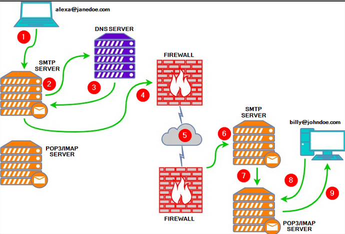

## Overview
This diagram explains how an email travels from the sender to the recipient using SMTP, DNS, Firewalls, and POP3/IMAP servers.

---

## Step-by-Step Process

### 1️⃣ User Sends Email
The sender composes and sends an email from their email client (e.g., Outlook, Gmail).

---

### 2️⃣ Email Reaches Sender's SMTP Server
The email is sent to the sender's SMTP (Simple Mail Transfer Protocol) server for processing and delivery.

---

### 3️⃣ DNS Lookup
The SMTP server queries the DNS (Domain Name System) server to find the recipient domain's mail server (MX record).

---

### 4️⃣ Email Passes Through Firewall
The outgoing email passes through the organization's firewall for security inspection and filtering.

---

### 5️⃣ Email Travels Over the Internet
The email is transmitted across the internet to the recipient's mail server.

---

### 6️⃣ Recipient's SMTP Server Receives Email
The recipient’s SMTP server accepts the email and verifies it.

---

### 7️⃣ Email Stored in POP3/IMAP Server
The email is stored on the recipient’s mail server (POP3 or IMAP server).

---

### 8️⃣ Recipient Checks Mail
The recipient’s email client connects to the POP3/IMAP server to access the email.

---

### 9️⃣ Email Delivered to Recipient
The recipient successfully reads the email on their device.

---

## Protocols Involved

- **SMTP** → Used for sending emails  
- **DNS** → Used to locate recipient mail server  
- **POP3/IMAP** → Used for retrieving emails  
- **Firewall** → Provides security filtering  

---

## Security Perspective (SOC Level 1)

During phishing investigations, analysts check:

- SMTP headers
- Sender IP address
- DNS lookup results
- Firewall logs
- POP3/IMAP login activity

---

<h1 align="center">Understanding an Email Header & How to Analyze It</h1>

## Scenario

In this example, the **Sender** `mt.kb.user@gmail.com` sends an email to the **Receiver** `user@example.com`.

- The sender composes the email at **gmail.com**
- The receiver reads it in **Apple Mail**

---

## Example Email Header

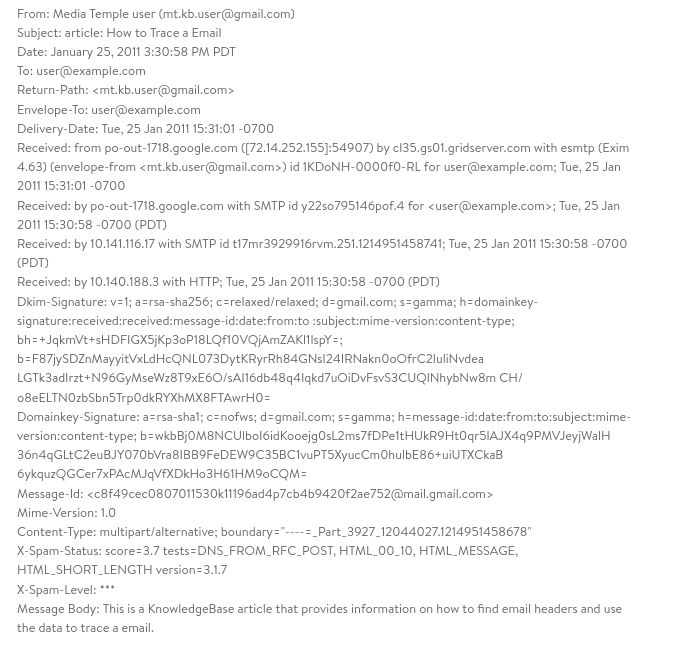

---

# How to Analyze an Email Header (Updated Example)

Below is the full header used for analysis:

## Step 1: Analyze the "From" Field

**From:** Media Temple user (mt.kb.user@gmail.com)

- Sender claims to be a Gmail user.
- The visible name is "Media Temple user".
- This field can be forged in phishing emails.
- Must verify using authentication results and Received headers.

---

## Step 2: Verify Return-Path

**Return-Path:** mt.kb.user@gmail.com

- Return-Path matches the From address.
- No mismatch detected.
- If Return-Path used a different domain → suspicious.

---

## Step 3: Analyze Received Lines (Most Important)

Read from bottom to top.

### Bottom Received Line (Origin)
**Received:** by 10.140.188.3 with HTTP; Tue, 25 Jan 2011 15:30:58 -0700 (PDT)

- Indicates email was submitted via web (HTTP).
- Likely sent using Gmail web interface.

### Next Received
**Received:** by 10.141.116.17 with SMTP id ...

- Internal Google mail server processing.

### Next
**Received**: by po-out-1718.google.com with SMTP ...

- Outgoing Google mail server.

### Top Received (Delivered to Recipient Server)

Received: from po-out-1718.google.com ([72.14.252.155]:54907)
by cl35.gs01.gridserver.com with esmtp ...

- Sending IP: **72.14.252.155**
- Appears to belong to Google mail infrastructure.
- Delivered successfully to recipient mail server.

✔ Email path appears legitimate.

---

## Step 4: Check DKIM Signature

Dkim-Signature: d=gmail.com;

- Domain signing the email: gmail.com
- Matches sender domain.
- Indicates authentication was applied.

---

## Step 5: Check DomainKey

Domainkey-Signature: d=gmail.com;

- Additional authentication method.
- Confirms Gmail signing infrastructure.

---

## Step 6: Check Message-ID

Message-Id: c8f49cec0807011530k11196ad4p7cb4b9420f2ae752@mail.gmail.com

- Generated by Gmail server.
- Domain matches gmail.com.
- Looks consistent.

---

## Step 7: Analyze Content-Type

Content-Type: multipart/alternative;

- Email contains:
  - Plain text version
  - HTML version
- Phishing emails often use HTML for malicious links.

---

## Step 8: Check Spam Score

X-Spam-Status: score=3.7
X-Spam-Level: ***

- Spam score is moderate.
- Not extremely malicious.
- Should still review body content.

---

# SOC Analyst Investigation Summary

✔ From domain matches DKIM  
✔ Return-Path matches sender  
✔ Sending IP belongs to Google mail server  
✔ Message-ID matches Gmail domain  
✔ Email passed through legitimate Google SMTP servers  

Based on header analysis → This email appears legitimate.

Further investigation should include:

- URL inspection (if present)
- Attachment hash analysis
- Body content review
- Reputation check of sending IP

---

# Final Conclusion

Email header analysis helps identify:

- Spoofed domains
- Suspicious IP addresses
- Authentication failures
- Phishing attempts

In this case, header analysis does not indicate spoofing or malicious origin.

# Task 2: The Email Address
## Q1: Email dates back to what time frame?

**Ans:** 1970s

----

# Task 3: Email Delivery

## Q1: What port is classified as Secure Transport for SMTP?

**Ans:** 465

---

## Q2: What port is classified as Secure Transport for IMAP?

**Ans:** 993

---

## Q3: What port is classified as Secure Transport for POP3?

**Ans:** 995

---

# Task 4: Email Headers

## Q1: What email header is the same as “Reply-to”?

**Ans:** Return-Path

---

## Q2: Once you find the email sender’s IP address, where can you retrieve more information about the IP?

**Ans:** http://www.arin.net/

---

# Task 5: Email Body

## Q1: In the above screenshots, what is the URI of the blocked image?

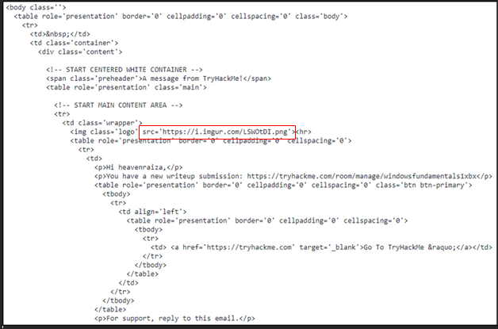

**Ans:** https://i.imgur.com/lsw0tdi.png

---

## Q2: In the above screenshots, what is the name of the PDF attachment?

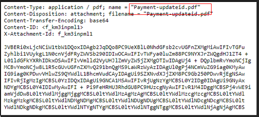

**Ans:** Payment-updateid.pdf

---

## Q3 In the attached virtual machine, view the information in email2.txt and reconstruct the PDF using the base64 data. What is the text within the PDF?

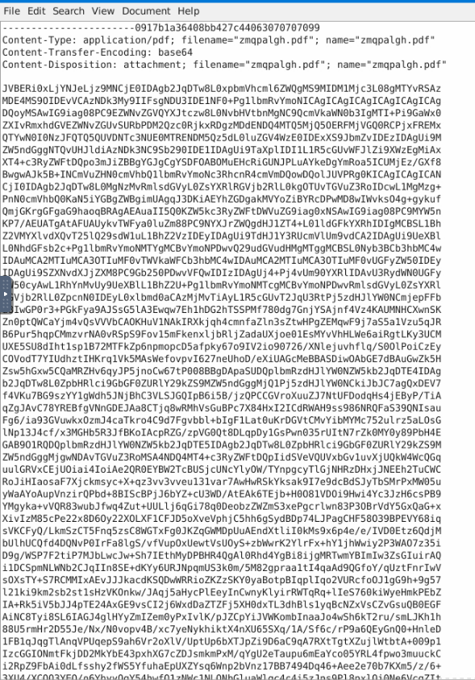

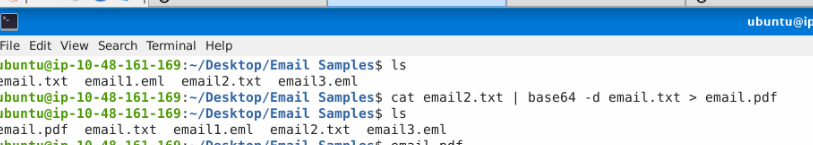

cat email2.txt: Reads the content of the email2.txt file.

| base64 -d: Decodes the Base64-encoded content of email2.txt.

email.txt > email.pdf: The decoded content is saved as a file named email.pdf.

Go Back to the Email Samples Folder and open email.pdf

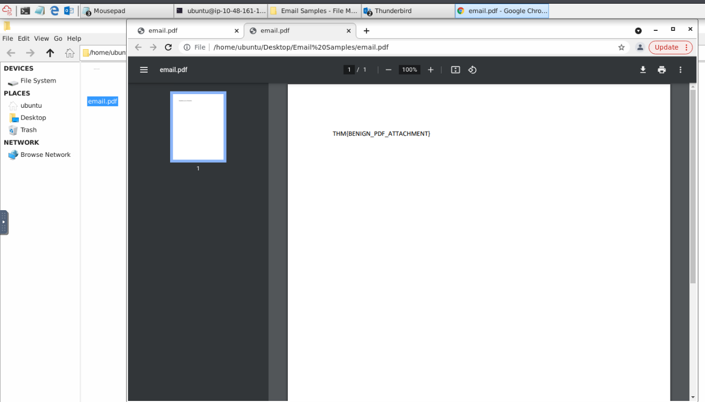

We can see the flag

Answer: THM{BENIGN_PDF_ATTACHMENT}

# Task 6 Types of Phishing

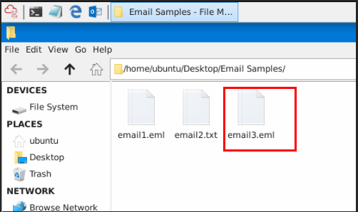

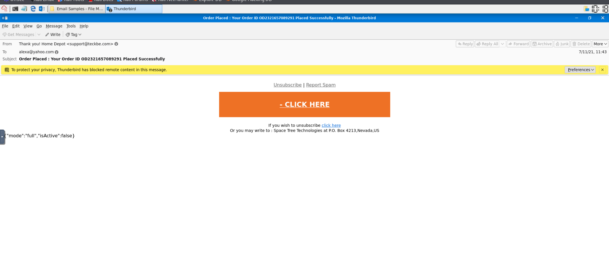

### Q6.1 What trusted entity is this email masquerading as?

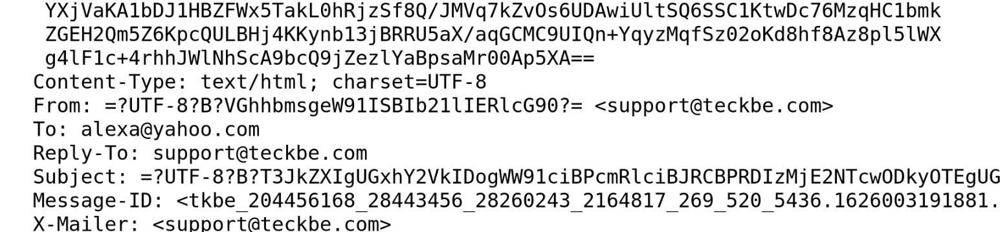

From: =**?UTF-8?B?** VGhhbmsgeW91ISBIb21lIERlcG90?= <support@teckbe.com>

The part between =?UTF-8?B? and ?= is the Base64 encoded text

VGhhbmsgeW91ISBIb21lIERlcG90

Using CyberChef to encode from Base64

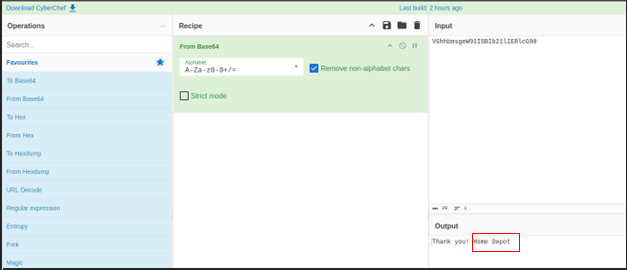

**Answer**: Home Depot

### Q 6.2 What is the sender’s email?

Return-Path: <support@teckbe.com>

**Answer**: support@teckbe.com

### Q 6.3 What is the subject line?

Subject: =?UTF-8?B?T3JkZXIgUGxhY2VkIDogWW91ciBPcmRlciBJRCBPRDIzMjE2NTcwODkyOTEgUGxhY2VkIFN1Y2Nlc3NmdWxseQ==?=

=?UTF-8?B?…?=:

UTF-8 indicates the encoding format.

B (Base64) indicates the text is Base64 encoded.

Answer: Order Placed: Your Order ID OD2321657089291 Placed Successfully

### Q 6.4 What is the URL link for — CLICK HERE? (Enter the defanged URL) (Question Hint There are repeat characters that you can remove from the URL. CyberChef can help you with this, along with defanging)

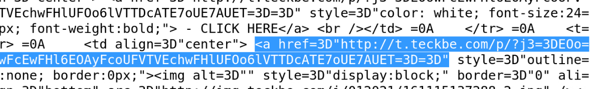

 URLs can contain repeated or extra characters added by encoding processes (== at the end or unnecessary line breaks)  **Remove it** 

Suspicious Link Analysis

The following URI was found in the email content:
[ link](http://t.teckbe.com/p/?j3=EOowFcEwFHl6EOAyFcoUFVTVEchwFHlUFOo6lVTTDcATE7oUE7AUET==)

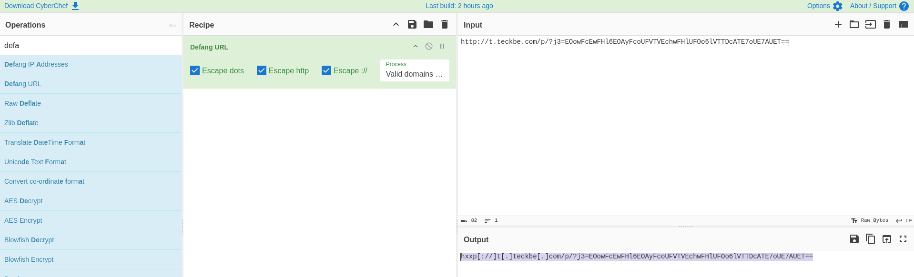

**Answer**: hxxp[://]t[.]teckbe[.]com/p/?j3=EOowFcEwFHl6EOAyFcoUFVTVEchwFHlUFOo6lVTTDcATE7oUE7AUET

