

# Phishing Analysis Tools

## Task 2: What information should we collect?

In this task, we will outline the steps performed when analyzing a suspicious or malicious email. 

Below is a checklist of the pertinent information an analyst (you) is to collect from the email header:

- Sender email address
-Sender IP address
- Reverse lookup of the sender IP address
- Email subject line
-  Recipient email address (this information might be in the CC/BCC field)
- Reply-to email address (if any)
-  Date/time

Afterward, we draw our attention to the email body and attachment(s) (if any).

Below is a checklist of the artifacts an analyst (you) needs to collect from the email body:

- Any URL links (if an URL shortener service was used, then we’ll need to obtain the real URL link)
- The name of the attachment
- The hash value of the attachment (hash type MD5 or SHA256, preferably the latter)

---

## Task 3: Email header analysis

## ✅ MUST USE (Core Tools for Email Header Analysis)

These tools are essential for proper email header investigation.

---

## 1️⃣ Message Header / Raw Header

✔ You must analyze this manually.  
✔ Extract the following information:

- Sender IP  
- Received chain  
- Return-Path  
- Message-ID  
- Authentication results (SPF, DKIM, DMARC)

👉 This is the foundation of email header analysis.

---

## 2️⃣ Message Header Analyzer  
*(Example: Google Admin Toolbox Message Header Analyzer)*

✔ Paste the full header into the tool.  
✔ It helps to:

- Show email path visually  
- Highlight delivery delays  
- Display authentication status  

👉 Very useful for beginners and quick investigation.

---

## 3️⃣ IPinfo.io

✔ Used to check the sender’s IP address.  
✔ Helps identify:

- ISP  
- Organization  
- Country  
- ASN (Autonomous System Number)

👉 Important for detecting suspicious or foreign IP sources.

---

## 4️⃣ Talos Reputation Center

✔ Used to check:

- IP reputation  
- Domain reputation  
- Blacklist status  

👉 Very important for SOC investigations and phishing detection.

---

# ⚡ Useful but Optional Tools

## 5️⃣ mailheader.org

- Alternative email header analyzer  
- Similar functionality to Google Header Analyzer  

✔ You can use either one.

---

## 6️⃣ URLScan.io

Only required if:

- The email contains suspicious links  
- You want to analyze a phishing URL  

✔ Not required for pure email header analysis.

---

 ## Task 4 Email body analysis

 ## SOC Investigation Tools for Phishing Analysis

## 🥇 1️⃣ VirusTotal (BEST Overall for SOC)

### 🔍 Definition
VirusTotal is an online threat intelligence platform that analyzes files, URLs, IP addresses, and domains using multiple antivirus engines and security vendors to detect malicious activity.

### ✔ What You Can Check
- URL reputation  
- IP reputation  
- File hash  
- Domain reputation  
- Sandbox behavior  

### ✔ What It Shows
- Detection results from 60+ antivirus engines  
- Community comments and threat intelligence  
- File behavior analysis  
- Historical scan results  

---

## 🥈 2️⃣ Talos File Reputation 

### 🔍 Definition
Talos Intelligence (by Cisco) is a threat intelligence platform that provides reputation data for IP addresses, domains, files, and email sources based on Cisco’s global threat monitoring network.

### ✔ What It Checks
- IP reputation  
- Domain reputation  
- File reputation  
- Email reputation  

### 💡 Why It’s Important
- Widely used in enterprise environments  
- Integrated into Cisco security products  
- Trusted source for corporate SOC teams  

👉 Very useful for corporate SOC roles.

---

##  3️⃣ URL Extractor 

### 🔍 Definition
A URL Extractor is a tool used to extract hidden or embedded links from email bodies, attachments, or encoded content for further analysis.

### ✔ What It Does
- Extract hidden URLs from email body  
- Extract links from attachments  
- Decode obfuscated URLs  

⚠ It does NOT check reputation.  
It only extracts links.

---

# 🎯 Recommended SOC Workflow

1️⃣ Extract URLs using URL Extractor  
2️⃣ Check URL/IP/Domain in VirusTotal  
3️⃣ Cross-check reputation in Talos  
4️⃣ Analyze file hash if attachment is present  

This structured approach reflects real SOC Level 1 investigation workflow.

## Task 5 Malware Sandbox

## Advanced Sandbox Tools for SOC Analysis

## 🥇 1️⃣ ANY.RUN

### 🔍 Definition
ANY.RUN is an interactive online malware sandbox that allows analysts to execute suspicious files or URLs in a controlled environment and observe real-time behavior.

### ✔ Key Features
- Interactive analysis (you can click, type, and simulate user behavior)
- Real-time process monitoring
- Network traffic analysis
- Registry and file activity tracking
- Screenshots and full execution timeline

### 💡 Why It’s Useful for SOC
- Helps analyze phishing attachments
- Detects malicious behavior not visible in static scans
- Good for beginner to intermediate analysts

👉 Best for interactive, hands-on malware investigation.

---

## 🥈 2️⃣ Hybrid Analysis

### 🔍 Definition
Hybrid Analysis is a free malware analysis service powered by CrowdStrike that performs automated static and dynamic analysis of suspicious files and URLs.

### ✔ Key Features
- Automated sandbox execution
- Behavioral analysis reports
- Threat scoring
- MITRE ATT&CK mapping
- Extracted indicators (IPs, domains, hashes)

### 💡 Why It’s Useful for SOC
- Provides detailed technical reports
- Shows malware behavior patterns
- Helps extract IOCs for incident response

👉 Best for detailed automated malware reports.

---

# 🎯 When to Use These Tools

Use ANY.RUN or Hybrid Analysis when:

- You have a suspicious attachment
- You want to observe malware behavior
- VirusTotal shows suspicious results but you need deeper analysis
- You need to extract IOCs for investigation

---

# 🛡 SOC Investigation Workflow (Advanced)

1️⃣ Check hash in VirusTotal  
2️⃣ If suspicious → Upload to ANY.RUN or Hybrid Analysis  
3️⃣ Observe behavior  
4️⃣ Extract IOCs (IP, domain, file paths, registry changes)  
5️⃣ Add findings to incident report  

---

# 🔥 Comparison

| Tool | Type | Best For |
|------|------|----------|
| VirusTotal | Reputation Check | Quick verification |
| ANY.RUN | Interactive Sandbox | Manual behavior analysis |
| Hybrid Analysis | Automated Sandbox | Detailed behavioral report |

# What is PhishTool?

## 🔍 Definition

PhishTool is an online phishing analysis platform designed to help security analysts investigate suspicious emails, URLs, and attachments in a structured and collaborative way.

It is commonly used by SOC (Security Operations Center) teams to analyze phishing emails and document findings.

---

## 🎯 Purpose of PhishTool

PhishTool helps analysts:

- Parse and analyze email headers
- Extract URLs and attachments
- Decode obfuscated links
- Identify sender information
- Document investigation steps
- Share analysis with team members

---

## 🛠 Key Features

✔ Email header parsing  
✔ URL extraction  
✔ Attachment extraction  
✔ Threat intelligence enrichment  
✔ IOC (Indicators of Compromise) identification  
✔ Case management style investigation  

---

## 🛡 Why It’s Useful for SOC Analysts

- Simplifies phishing email investigations  
- Organizes findings in one place  
- Helps create professional incident reports  
- Improves collaboration in SOC environments  

---

## 🔄 Typical SOC Workflow Using PhishTool

1️⃣ Upload suspicious email (.eml file)  
2️⃣ Analyze header and sender details  
3️⃣ Extract embedded URLs  
4️⃣ Check URLs in VirusTotal or Talos  
5️⃣ Extract IOCs  
6️⃣ Document findings  

---

## 🔥 When Should You Use PhishTool?

Use PhishTool when:

- Investigating phishing emails  
- Performing email header analysis  
- Extracting hidden links  
- Creating structured phishing reports  

---

**Q1** Look at the Strings output. What is the name of the EXE file?

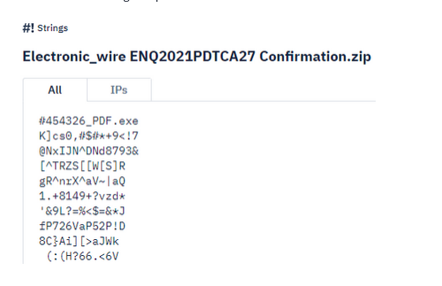

**Answer**: 454326_PDF.exe

---

## Task 7: Phishing Case 1

Scenario: You are a Level 1 SOC Analyst. Several suspicious emails have been forwarded to you from other coworkers. You must obtain details from each email for your team to implement the appropriate rules to prevent colleagues from receiving additional spam/phishing emails. 

Task: Use the tools discussed throughout this room (or use your own resources) to help you analyze each email header and email body. 

**Q2** What brand was this email tailored to impersonate?

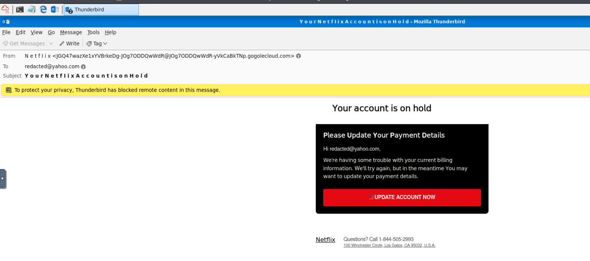

**Answer** : Netflix

**Q3** What is the From email address?

**Email Haider Analyzer** : MX Tool Box 

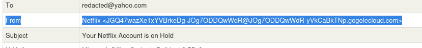

**Answer** : JGQ47wazXe1xYVBrkeDg-JOg7ODDQwWdR@JOg7ODDQwWdR-yVkCaBkTNp.gogolecloud.com

**Q4** What is the originating IP? Defang the IP address. 

**Email Haider Analyzer** : MX Tool Box 

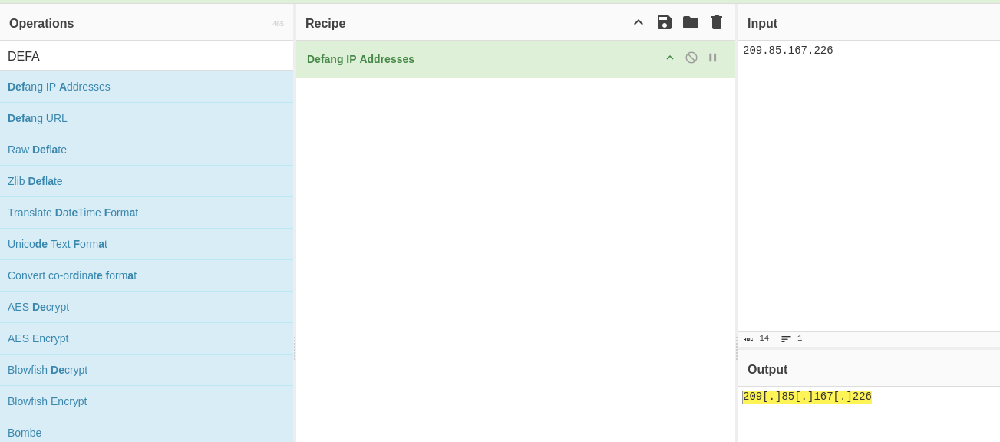

**Answer** : 209[.]85[.]167[.]226

**Q5** From what you can gather, what do you think will be a domain of interest? Defang the domain.

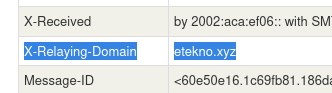

Answer: etekno[.]xyz

**Q6** What is the shortened URL? Defang the URL.

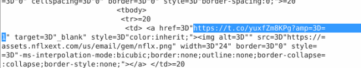

Answer : hxxps[://]t[.]co/yuxfzm8kpg?amp=1

---

## Task 8: Phishing Case 2

**Q7** What does AnyRun classify this email as?

Answer : Suspicious activity

**Q8** What is the name of the PDF file?

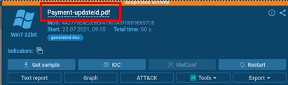

Answer : Payment-updateid.pdf 

**Q9** What is the SHA 256 hash for the PDF file?

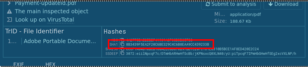

Answer : CC6F1A04B10BCB168AEEC8D870B97BD7C20FC161E8310B5BCE1AF8ED420E2C24

**Q10** What two IP addresses are classified as malicious? Defang the IP addresses. (answer: IP_ADDR,IP_ADDR)

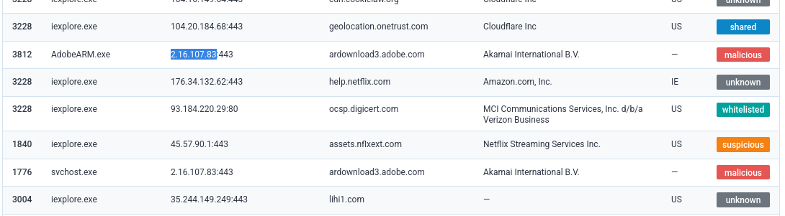

Answer : 2[.]16[.]107[.]24,2[.]16[.]107[.]83

**Q11** What Windows process was flagged as Potentially Bad Traffic?

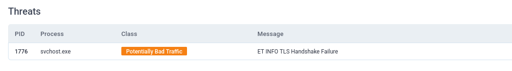

Answer : svchost.exe

---

## Task 9: Phishing Case 3

**Q12** What is this analysis classified as?

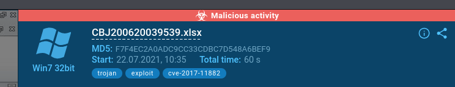

Answer : Malicious activity

**Q13** What is the name of the Excel file?

Answer : CBJ200620039539.xlsx

**Q14** What is the SHA 256 hash for the file?

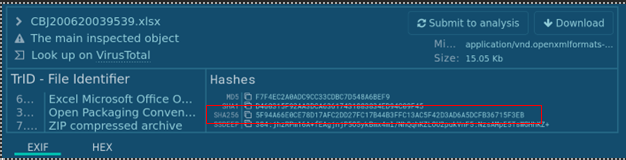

Answer : 5f94a66e0ce78d17afc2dd27fc17b44b3ffc13ac5f42d3ad6a5dcfb36715f3eb

**Q15** What domains are listed as malicious? Defang the URLs & submit answers in alphabetical order. (answer: URL1,URL2,URL3)

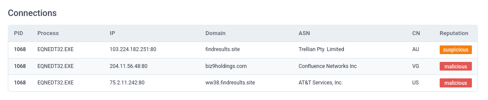

Answer : biz9holdings[.]com,findresults[.]site, ww38[.]findresults[.]site

**Q16** What IP addresses are listed as malicious? Defang the IP addresses & submit answers from lowest to highest. (answer: IP1,IP2,IP3)

Answer : 204[.]11[.]56[.]48,103[.]224[.]182[.]251,75[.]2[.]11[.]242

**Q17** What vulnerability does this malicious attachment attempt to exploit?

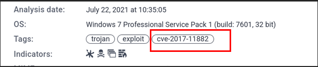

Answer : CVE-2017-11882

