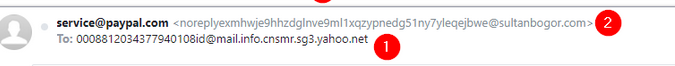
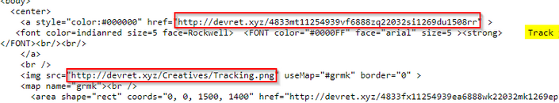
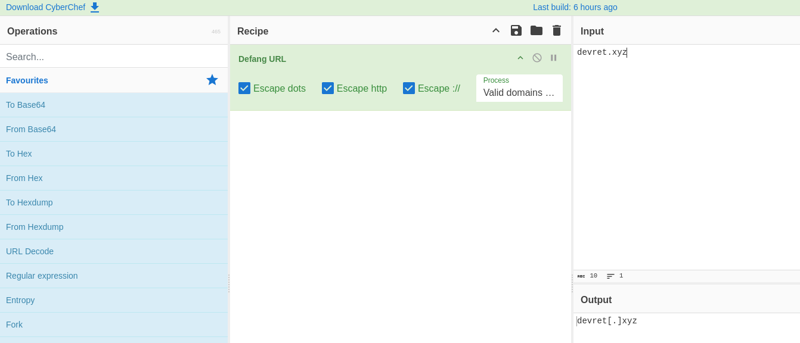
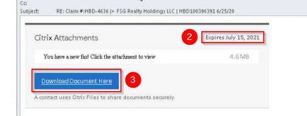
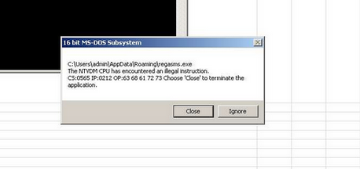

# Phishing Emails in Action

## Task 2: Cancel your PayPal order

## What is a Gibberish Sender Email?

A **gibberish sender email** is an email address that appears random, meaningless, or automatically generated instead of a normal, human-readable name.

It often contains:

- Random letters and numbers  
- Long confusing strings  
- Misspelled or suspicious domains  
- No clear identity  

---

## Example of a Gibberish Email

xjh34gs65fg@randomdomain.xyz

These look suspicious because:

- The name has no clear meaning  
- It appears auto-generated  
- It is commonly used in phishing or spam emails  

---

## Why Attackers Use Gibberish Emails

Phishing attackers use gibberish sender emails to:

- Avoid detection  
- Bypass spam filters  
- Trick users into thinking the email is system-generated (e.g., "noreply")  

---

## SOC Analyst Tip

When analyzing email headers:

- Check if the sender address looks random  
- Verify the domain reputation  
- Compare **From** and **Return-Path** fields  
- Inspect the **Received** headers  

---

In phishing investigations, a gibberish sender email is often an early indicator of a suspicious or malicious email.

## Questions

**Question No 1:** What phrase does the gibberish sender email start with?

**Answer:** noreply

# Task 3: Track your package

Key observations:

- The email is designed to appear as if it’s sent from a mail distribution center.
- The subject line reinforces the deception with a ‘tracking number.’
- The link in the email body corresponds to the subject line.

Additional notes:

- Yahoo blocked image loading, possibly to prevent pixel tracking and link inspection.
- The email contains an image file named “Tracking.png” that acts as a tracking pixel, sending data back to the sender’s server.
- Spammers use tracking pixels for various purposes, including monitoring email opens and user interactions.
- The hyperlink points to a suspicious domain, potentially associated with malware, but further analysis is needed for confirmation.

**Question No 2:** What is the root domain for each URL? Defang the URL. 

**Answer**: devret[.]xyz

---

## Task 4: Select your email provider to view document

- Techniques used in the email:
    -  Creates a sense of urgency (e.g., “link expires today”)
    -   HTML impersonation of legitimate brands (OneDrive, Adobe)
    -   Link manipulation to redirect victims to fake pages
    -   Credential harvesting by asking users to log in
        Poor grammar and typos
-  Red flags and observations:
   - Email prompts immediate action with a “download the fax” button.
    -  Links redirect to non-Microsoft and non-Adobe URLs despite appearing legitimate.
    - Page titles and branding are faked (e.g., “Share Point Online”) to appear trustworthy.
    -  Victims are prompted to log in with their email credentials; credentials are sent to the attacker.
    -  Even correct credentials would trigger a fake error message, ensuring the attacker still collects them.
    -  Multiple grammatical errors reveal the email is suspicious.

**Question No 3:** This email sample used the names of a few major companies, their products, and logos such as OneDrive and Adobe. What other company name was used in this phishing email?

**Answer**: Citrix

---

## Task 5: Please update your payment details

In this task we look at yet another email. Here are the main points:

- Techniques used: Spoofed email address, urgency, HTML impersonation of Netflix, poor grammar/typos, attachments.
-  Sender spoofing: Appears to be from Netflix Billing, but the actual sender is z99@musacombi.online.
-  Urgency: Claims the account is suspended, pressuring the victim to act quickly; reinforced throughout the email body.
-  Typos: Netflix is misspelled multiple times, though not as part of typosquatting.
-   Attachment: A PDF is included, prompting the victim to “Update Payment Account.”
-  Suspicious details: The phone number listed is unusual for a US-based Netflix account.
  -  Overall: The email uses urgency, brand impersonation, and a malicious attachment to trick the recipient into interacting and potentially revealing sensitive information.

**Question No 4:** What should users do if they receive a suspicious email or text message claiming to be from Netflix?

**Answer**: forward the message to phishing@netflix.com

---

# Task 6: Your recent purchase

**Question No 5:** What does BCC mean?

Blind Carbon Copy: It is quite similar to CC which you might be more familiar with: carbon copy. This means that whose address appears after the Cc: header would receive a copy of the message. Bcc is similar to this, but this time the recipients specified in this field do not appear in the received message header and the recipients in the To or Cc fields will not know that a copy sent to these address.

**Answer** : Blind Carbon Copy

**Question No 6:** What technique was used to persuade the victim to not ignore the email and act swiftly?

The message implies action is required, pushing the victim to respond quickly. We call this urgency.

Answer: Urgency

## Task 7: DHL Express Courier Shipping notice

 - Opening the attachment reveals content designed to appear legitimate, but the document executes a payload that results in an error.
- This email demonstrates spoofed sender information, HTML used to imitate DHL, and the use of a malicious attachment.
- The sender address doesn’t match DHL, even though the email claims to be about a package the company is supposedly shipping.
- The body of the email uses HTML to mimic an authentic DHL message.
- When examining the email’s source code, the “view as a web page” link has no actual destination, which is a strong sign of a poorly constructed phishing attempt.
- The only interactive element is the attachment—an Excel file.

**Question No 7:** What is the name of the executable that the Excel attachment attempts to run?

**Answer**: regasms.exe

