<div align="center">

# Phishing Prevention

</div>

## Task 1: Introduction

- Email Security (SPF, DKIM, DMARC): Implementing these email authentication protocols can help verify the legitimacy of incoming emails, reducing the risk of phishing attacks.
- SPAM Filters: These filters flag or block incoming emails based on their reputation, helping to prevent potentially harmful messages from reaching the inbox.
-  Email Labels: Alerting users when an incoming email is from an outside source can raise awareness about potential risks associated with external emails.
- Email Address/Domain/URL Blocking: By blocking email addresses, domains, or URLs with a poor reputation or those on explicit denylists, defenders can prevent known sources of malicious emails from reaching users.
- Attachment Blocking: Blocking email attachments based on their file extensions can prevent the spread of malicious files through email.
-  Attachment Sandboxing: Detonating email attachments in a sandbox environment helps detect and isolate potentially malicious activities, protecting users from harmful content.
-  Security Awareness Training: Conducting internal phishing campaigns as part of security awareness training helps educate users about the dangers of phishing and how to recognize phishing attempts.

---

## Task 2  Sender Policy Framework (SPF)

##  Sender Policy Framework (SPF)

**Sender Policy Framework (SPF)** is an email authentication protocol that helps prevent **email spoofing** and **phishing attacks**.

SPF allows a domain owner to specify which mail servers are authorized to send emails on behalf of their domain.

It works by publishing an **SPF record** inside the domain’s **DNS (Domain Name System)**.

---

# Sender Policy Framework (SPF) – Workflow Explanation

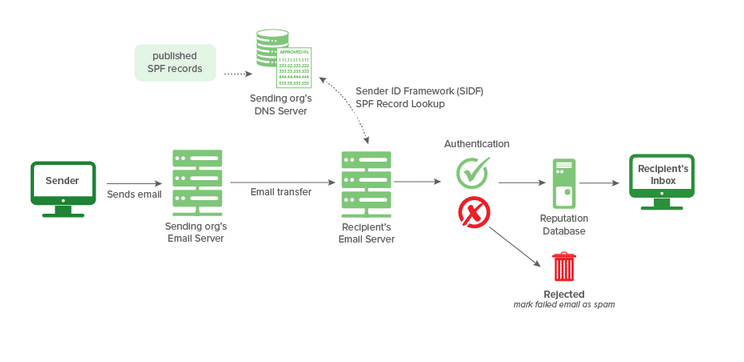

## 🔄 SPF Workflow 

### 1️⃣ Sender Sends Email
- The sender composes and sends an email.
- The email is sent through the **Sending Organization’s Mail Server**.

---

### 2️⃣ Email Transfer to Recipient Server
- The email travels across the internet.
- It reaches the **Recipient’s Mail Server**.

---

### 3️⃣ SPF Record Lookup (DNS Query)
- The recipient’s mail server performs a **DNS lookup**.
- It checks the sender's domain for a published **SPF TXT record**.
- The SPF record is stored in the domain's **DNS server**.

Example SPF record:

```txt
v=spf1 ip4:192.168.1.1 include:_spf.google.com -all
```

## SPF Records

Let's take a look at a sample SPF record and break down its format. Further information on SPF Record Syntax can be found here.

```v=spf1 ip4:127.0.0.1 include:_spf.google.com -all```

- v=spf1 Signifies the start of the SPF record
-  ip4:127.0.0.1 Specifies which IP can send mail (IPv4 in this case)
-  include:_spf.google.com Specifies which domain can send mail
-   -all Non-authorized emails will be rejected

**Question No 1**: Referencing the dmarcian SPF syntax table, what prefix character can be added to the “all” mechanism to ensure a “softfail” result

Answer: ~

**Question No 2**: What is the meaning of the -all tag?

Answer: fail

---

## Task 3: DKIM (DomainKeys Identified Mail)

# DomainKeys Identified Mail (DKIM)

**DomainKeys Identified Mail (DKIM)** stands for DomainKeys Identified Mail and is used for the authentication of an email that is being sent.

Like **SPF**, DKIM is an open standard for email authentication that is used for **DMARC alignment**.

A **DKIM record** exists in the domain's **DNS**, but it is more complex than SPF.

---

##  DKIM Workflow 

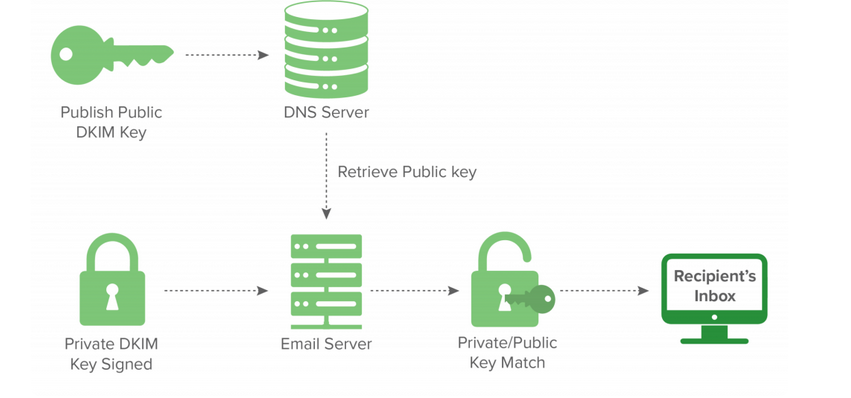

### 1️ Publish Public Key in DNS

- The domain owner generates:
  -  A **Private Key**
  -  A **Public Key**
- The **Public Key** is published in the domain's **DNS** as a TXT record.
- This record is called the **DKIM record**.

Example DNS record:

```txt
selector._domainkey.example.com TXT "v=DKIM1; k=rsa; p=PUBLICKEY"
 ```
2 Email is Signed with Private Key

- When sending an email:

  - The sending mail server uses the Private Key

  - It creates a digital signature

- The signature is added to the email header as:

```DKIM-Signature:```


3 This signature is generated using:

- Email body

- Selected headers

- Private key

3 Email Sent to Recipient Server

- The email travels to the recipient's mail server.

- The DKIM signature remains attached in the header.

4 Public Key Retrieval (DNS Lookup)

- The recipient mail server:

  - Reads the DKIM signature

   - Identifies the selector

- Performs a DNS lookup

- It retrieves the Public Key from DNS.

5 Signature Verification

- The recipient server uses the Public Key

- It verifies the digital signature

- It checks whether:

   - The email was modified

    - The sender is authentic


## DKIM Records

Here is a sample DKIM record, along with its components.

v=DKIM1; k=rsa; p=<public_key>


- v=DKIM1 Specifies the version of DKIM being used (optional)
- k=rsa The key type. The RSA encryption algorithm is standard
-  p= This is the public key that will be matched to the private key to verify the DKIM signature

---

## PermError?

**PermError** stands for **Permanent Error**.

In email authentication (SPF / DKIM / DMARC), a PermError occurs when there is a **permanent problem in the domain’s DNS configuration** that prevents proper validation.

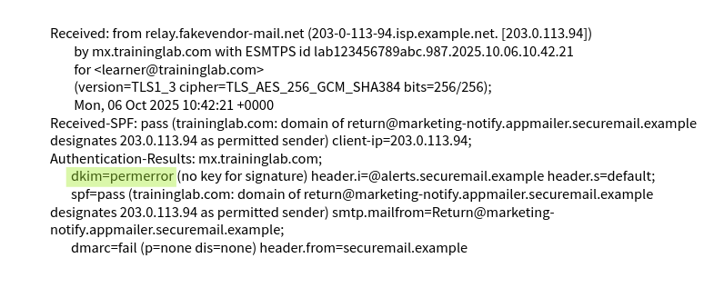

**Question No 3**: Which email header shows the status of whether DKIM passed or failed?

 Answer: Authentication-Results

 ---

## Task 4: DMARC (Domain-Based Message Authentication, Reporting, and Conformance)

##  DMARC?

**DMARC** stands for **Domain-Based Message Authentication, Reporting, and Conformance**.

DMARC is an email authentication protocol that builds on **SPF** and **DKIM** to protect domains from email spoofing, phishing, and impersonation attacks.

It allows domain owners to:

- Define how receiving servers should handle failed authentication
- Receive reports about email authentication results
- Enforce policy against unauthorized email senders

**Question No 5** : Which DMARC policy would you use not to accept an email if the message fails the DMARC check?

Answer: p=reject

---

## Task 5: S/MIME (Secure/Multipurpose Internet Mail Extensions)

##  S/MIME?

**S/MIME** stands for **Secure/Multipurpose Internet Mail Extensions**.

S/MIME is an email security standard that provides:

-  Email encryption
-  Digital signatures
-  Message integrity
-  Sender authentication

It ensures that emails are confidential and have not been modified during transmission.

S/MIME Example

- Bob wishes to securely send the email with S/MIME to Mary
-  Bob creates a digital certificate to generate the Digital Signature
- Bob "signs" the email message with his private key (Digital Signature)
- Bob openly shares his public key with Mary (Digital Signature)
- Bob also asks the public key of Mary to encrypt the email (Encryption)

- Mary verifies Bob's message with Bob's public key (Digital Signature)
-  Mary decrypts the received message with her private key (Encryption)
-  To send a reply email, Mary performs the same procedure from the start
-  Both Bob and Mary will now have each other's certificates for future correspondence

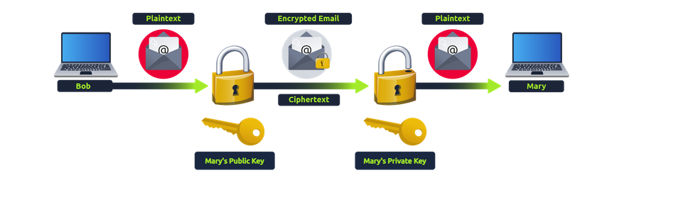

**Question No 6** : Which S/MIME component ensures that only the intended recipient can read the contents of an email message?

Answer : Encryption

---

## Task 6: Analyzing SMTP Responses

In this task, you will analyze a PCAP file with SMTP traffic. Some familiarity with traffic analysis using Wireshark will be helpful, as well as knowledge of SMTP Wireshark filters and status codes.

Go ahead and deploy the machine attached to this task. It will appear in the split-screen view when it’s ready. Then, open the traffic.pcap file on the Desktop to begin your examination.

**Question No 7** Which Wireshark filter can you use to narrow down your results based on SMTP response codes?

Answer: smtp.response.code

**Question No 8** How many packets in the capture contain the SMTP response code **220 Service ready**?

```smtp.response.code eq 220```

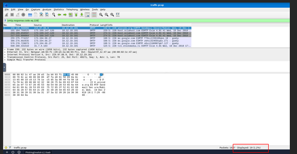

Answer: 19

**Question No 9** One SMTP response indicates that an email was blocked by ```spamhaus.org```. What response code did the server return?

```smtp```

 Edit -> Find Packet.

 ```spamhaus.org```

 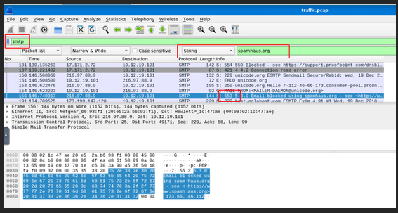

Answer: 553

**Question No 10** Based on the packet from the previous question, what is the full ```Response code:``` message?

 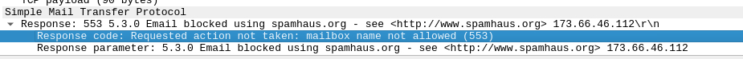

Answer: Requested action not taken: mailbox name not allowed (553)

**Question No 11** Search for response code 552. How many messages were blocked for presenting potential security issues?

```smtp.response.code eq 552```

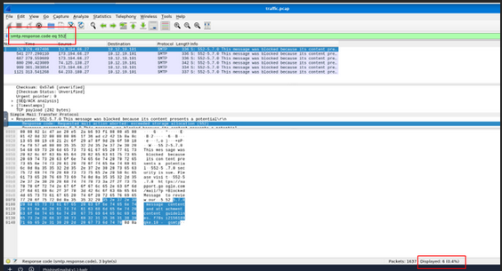

Answer: 6

---

## Task 7: Inspecting Emails and Attachments

**Question No 11** How many SMTP packets are available for analysis?

```smtp```

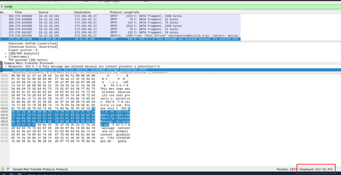

Answer: 512

**Question No 12** What is the name of the attachment in packet 270?

 Go -> Go to Packet -> 270

 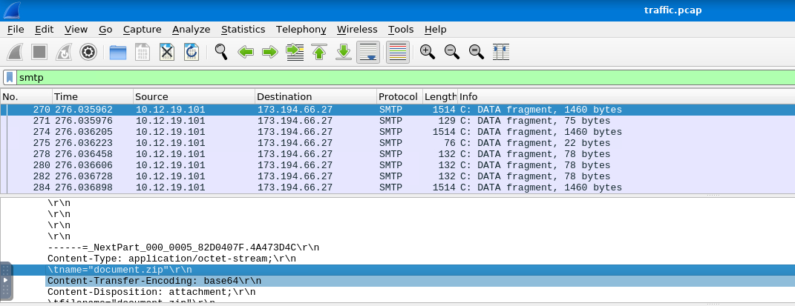

Answer: document.zip

**Question No 13** According to the message in packet ```270``` , which Host IP address is not responding, making the message undeliverable?

 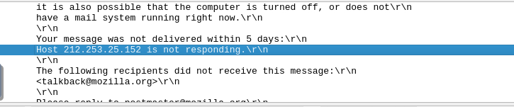

 Answer: 212.253.25.152

**Question No 14** By filtering for imf, which email client was used to send the message containing the attachment attachment.scr?

 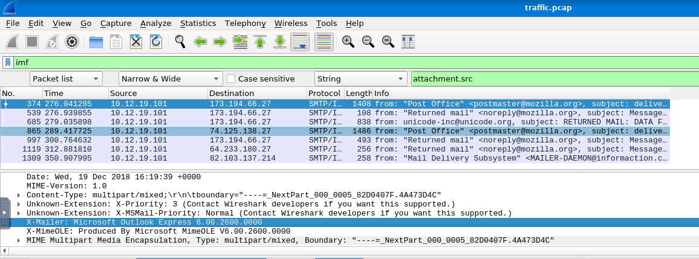

 Answer: Microsoft Outlook Express 6.00.2600.0000

 **Question No 15** Which type of encoding is used for this potentially malicious attachment?

  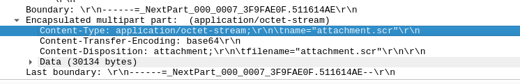

 **Question No 16** Just below the attachment name, there exists a field called Content-Transfer Encoding. This is set to base64.

 Answer: base64

 ---

## Task 8: How Organizations Stop Phishing

Technical Defenses

Modern email systems employ various technical controls to help detect and block phishing messages before they reach users.

- Email Filtering: Provides filtering based on IP and domain reputation, allowing for blocking or quarantining of suspicious messages.
-  Secure Email Gateways (SEGs): Scan messages to detect impersonation attempts, spoofing, and other phishing techniques that other filters might miss.
  -  Link Rewriting: Replaces suspicious or unknown URLs with safe, redirected ones, giving the system time to scan and verify the link.
  -  Sandboxing: Isolates and tests suspicious links or attachments in a secure, virtual environment to check for malicious behavior.

User-Facing Tools & Training

Even with strong technical defenses in place, some phishing emails will inevitably reach users. Giving users clear visual cues and education is essential.

  -  Trust & Warning Indicators: Modern email platforms display visual cues to help users understand if a message is safe. A banner may read “External Sender,” “Suspicious Link,” or signify that a message is from a trusted organization or sender. 
  -  Phishing Reporting: Easy, in-email reporting options that let users quickly report suspicious messages.
  -  User Awareness Training: Train employees on identifying phishing attempts, social engineering tactics, and safe email practices.
    Phishing Simulation Exercises: Run controlled phishing campaigns to test and reinforce employee training.

**Question No 17** A security team wants to implement a control to detect hidden malware inside email attachments.
They need a way to analyze suspicious files without risking infection on real systems.
Which protective technique would allow them to observe a file's behavior safely?

Answer: Sandboxing

