

# The Greenholt Phish

A Sales Executive at Greenholt PLC received an email that he didn't expect to receive from a customer. He claims that the customer never uses generic greetings such as "Good day" and didn't expect any amount of money to be transferred to his account. The email also contains an attachment that he never requested. He forwarded the email to the SOC (Security Operations Center) department for further investigation. 

Investigate the email sample to determine if it is legitimate. 

Deploy the Machine

Deploy the machine attached to this task; it will be visible in the split-screen view once it is ready.

If you don't see a virtual machine automatically appear, click the Show Split View button.

Tip: Open the EML file with Thunderbird. To do so, right-click on the challenge.eml file and select Open With Other Application. From there, scroll down to select Thunderbird Mail and click Open. It may take a few moments to open the application. You will then see the email and its contents appear in the app.

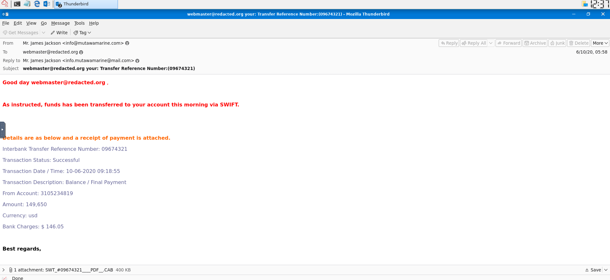

**Q1** What is the Transfer Reference Number listed in the email's Subject?

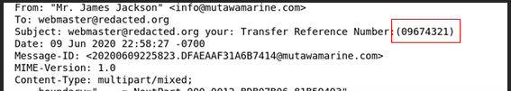

Answer : 09674321

**Q2** Who is the email from?

Answer : Mr. James Jackson

**Q3** What is his email address?

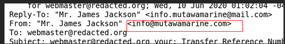

Answer : info@mutawamarine.com

**Q4** What email address will receive a reply to this email? 

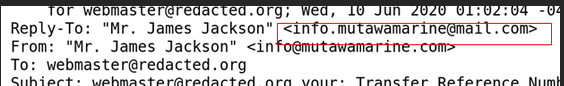

Answer: info.mutawamarine@mail.com

**Q5** What is the Originating IP?

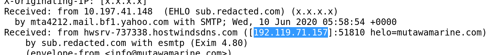

Answer : 192.119.71.157

**Q6** Who is the owner of the Originating IP? (Do not include the "." in your answer.)

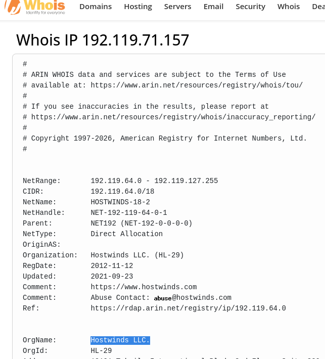

Answer : Hostwinds LLC

**Q7** What is the SPF record for the Return-Path domain?

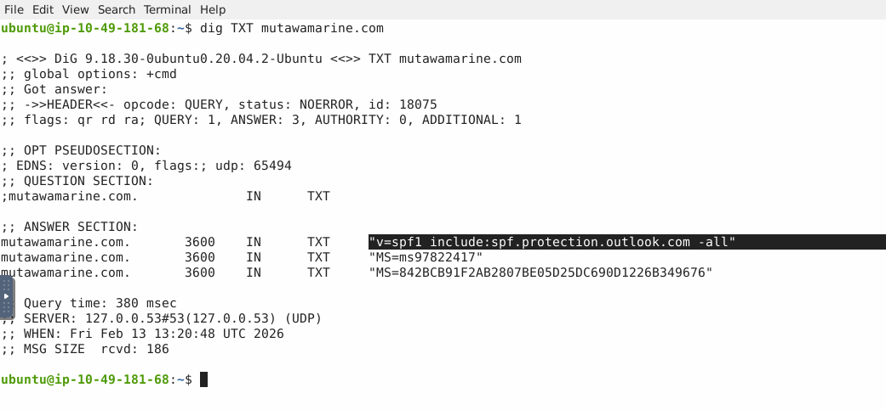

Answer: v=spf1 include:spf.protection.outlook.com -all

**Q8** What is the DMARC record for the Return-Path domain?

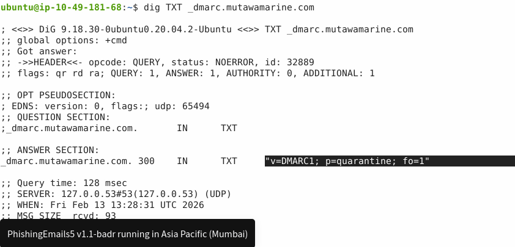

Answer : v=DMARC1; p=quarantine; fo=1

**Q9** What is the name of the attachment?

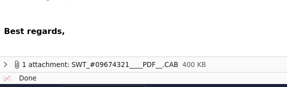

Answer : SWT_#09674321____PDF__.CAB

**Q10** What is the SHA256 hash of the file attachment?

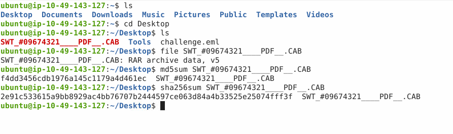

Answer : 2e91c533615a9bb8929ac4bb76707b2444597ce063d84a4b33525e25074fff3f

**Q11** What is the attachments file size? (Don't forget to add "KB" to your answer, NUM KB)

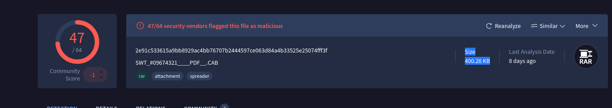

Answer: 400.26 kb 

**Q12** What is the actual file extension of the attachment?

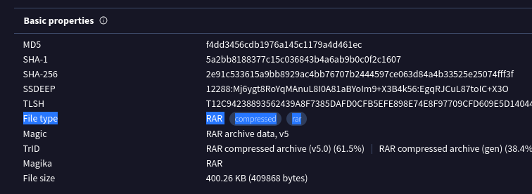

Answer : RAR 

