

# Wireshark: The Basics

## Task 1: Introduction

**Q1** Which file is used to simulate the screenshots?

Ans: http1.pcapng

**Q2** Which file is used to answer the questions

Ans: Exercise.pcapng

---

## Task 2: Tool Overview

1. **Live Packet Capture**
   - Captures traffic from Ethernet, Wi-Fi, and other interfaces.

2. **Deep Packet Inspection**
   - Shows detailed protocol information (TCP, UDP, HTTP, DNS, etc.)

3. **Display Filters**
   - Allows filtering traffic using expressions like:
     - `http`
     - `ip.addr == 192.168.1.1`
     - `tcp.port == 80`

4. **Color Coding**
   - Automatically highlights different protocol types.

5. **Export & Save Capture Files**
   - Saves files in `.pcap` or `.pcapng` format.

---

###  Common Use Cases in SOC Level 1

- Investigating suspicious IP addresses
- Detecting phishing or malware traffic
- Analyzing DNS queries
- Monitoring unusual outbound connections
- Identifying brute-force attempts

---

###  File Formats

- `.pcap`
- `.pcapng`

These files can be shared and analyzed later.

---

###  Why SOC Analysts Use Wireshark?

Wireshark provides packet-level visibility, making it one of the most powerful tools for network traffic investigation and cybersecurity analysis.

**Q3** Use the “Exercise.pcapng” file to answer the questions.

Read the “capture file comments”. What is the flag?

Open the pcap file and open the capture file properties dialog on the bottom left-side of the status bar.

Ans: TryHackMe_Wireshark_Demo

**Q4** What is the total number of packets?

Ans: 58620

**Q5** What is the SHA256 hash value of the capture file?

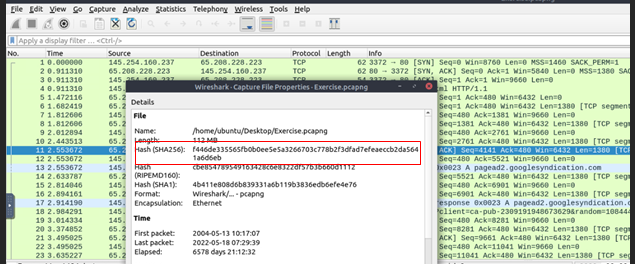

Ans: f446de335565fb0b0ee5e5a3266703c778b2f3dfad7efeaeccb2da5641a6d6eb

---

## Task 3: Packet Dissection

**Q6** Use the “Exercise.pcapng” file to answer the questions.

View packet number 38. Which markup language is used under the HTTP protocol?

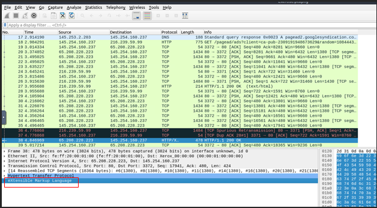

Ans: eXtensible Markup Language

**Q7** What is the arrival date of the packet? (Answer format: Month/Day/Year)

- packet details pane, under the HTTP protocol is the Markup Language used.

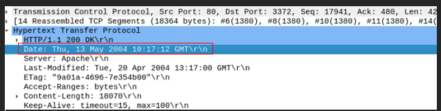

**Q8** What is the TTL value?

- The TTL value is found in Layer 3 of the OSI model, which is the Network Layer. Expand the Internet Protocol within the packet details pane.

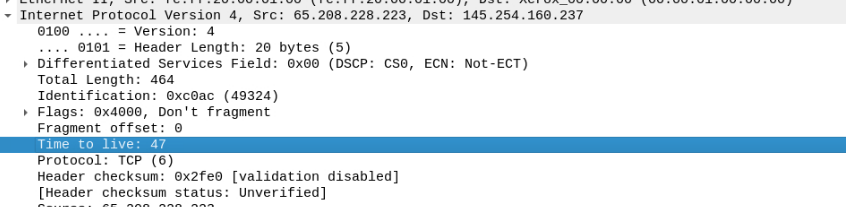

Ans: 47

**Q9** What is the TCP payload size?

- TCP details are found within the Transmission Control Protocol pane, which is the 4th layer of the OSI model.

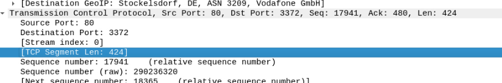

Ans: 424

**Q10** What is the e-tag value?

- This particular value is found in Hypertext Transfer Protocol pane, from the Application protocol layer of the OSI model.

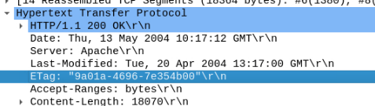

Ans: 9a01a-4696–7e354b00

---

## Task 4: Packet Navigation

**Q11** Use the "Exercise.pcapng" file to answer the questions. Search the "r4w" string in packet details. What is the name of artist 1?

- To find a specific string in Wireshark, go to **Edit → Find Packet**, select **String** as the search type, and enter the keyword "r4w" to locate the matching packet in the capture file.

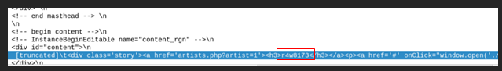

Ans : r4w8173

**Q12** Go to packet 12 and read the packet comments. What is the answer?
Note: use md5sum <filename> terminal command to get MD5 hash

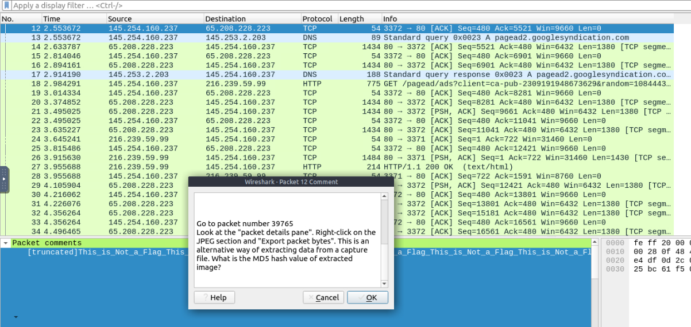

-  go to packet 39765, look at the packet details pane and export the packet bytes by right-clicking on the JPEG section.

- To extract an image file from Wireshark, select the packet containing the JPEG data, go to **File → Export Packet Bytes**, and save the file with a `.jpeg` extension to view the image.

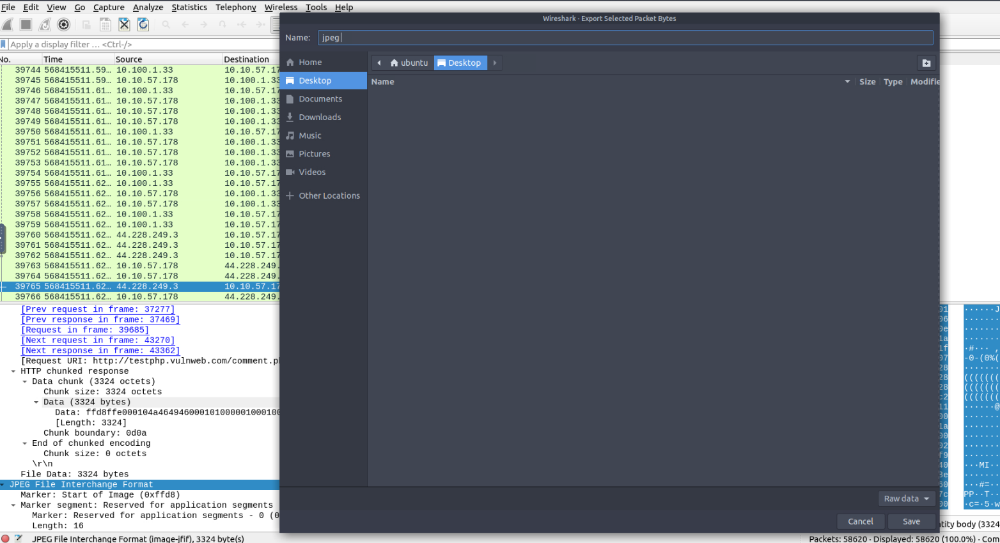

- Open a terminal and we will extract the MD5 hash value of the image.

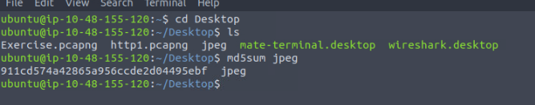

Ans: 911cd574a42865a956ccde2d04495ebf

**Q13**  There is a ".txt" file inside the capture file. Find the file and read it; what is the alien's name?

- Go to File menu then select Export Objects and then HTTP . Save the “note.txt” file.

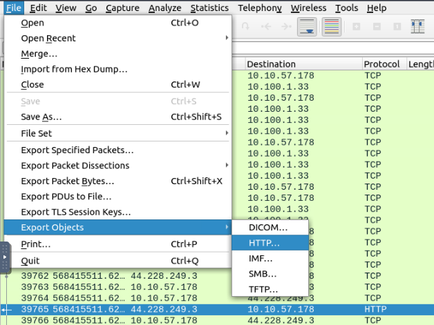

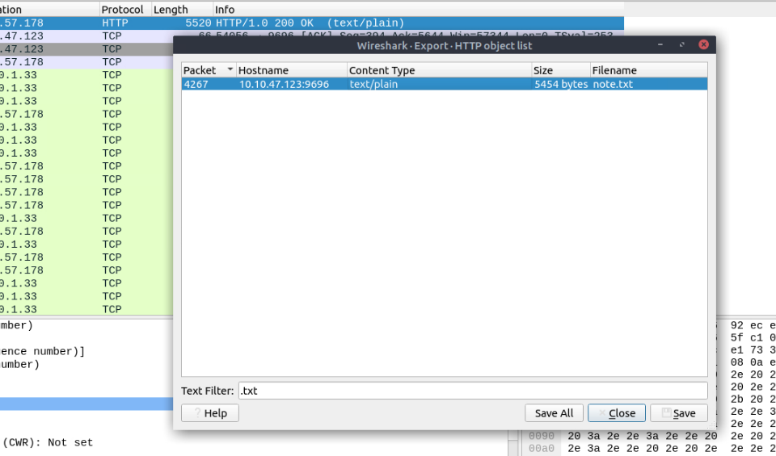

- Open and read the contents of the file. We can use a text editor or terminal to read the contents.

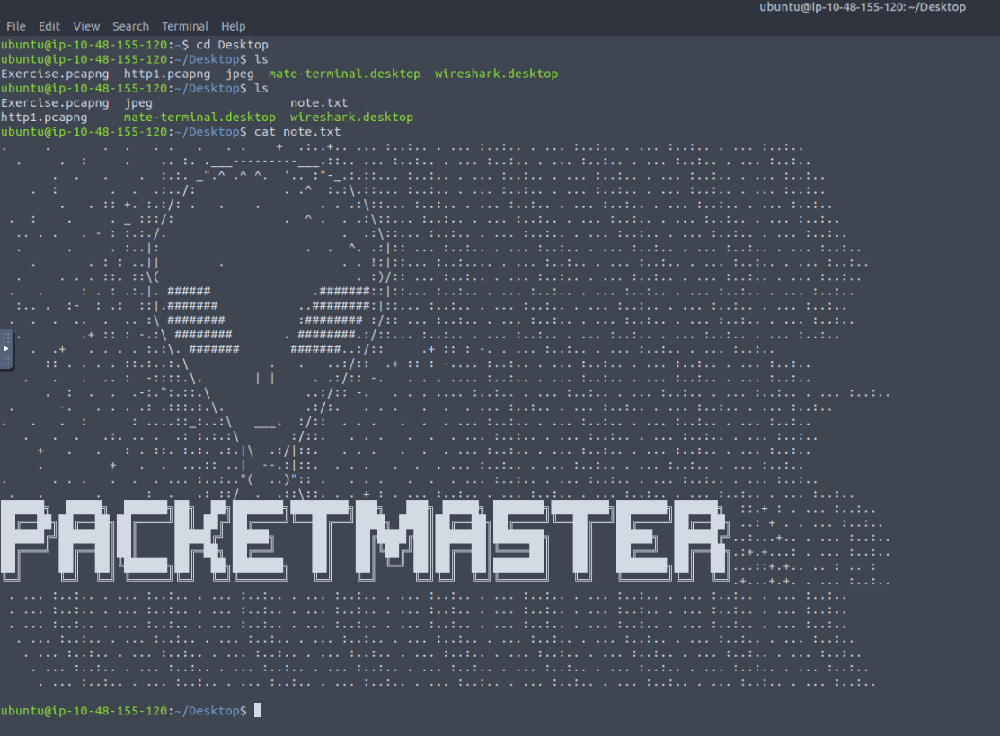

**Q14** Look at the expert info section. What is the number of warnings?

- We can either go to Analyze Menu then select Expert Information or at the bottom left part of the status bar and click on the first image.

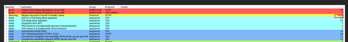

Ans: 1636

---

## Task 5: Packet Filtering

**Q15** Go to packet number 4. Right-click on the “Hypertext Transfer Protocol” and apply it as a filter. Now, look at the filter pane. What is the filter query?

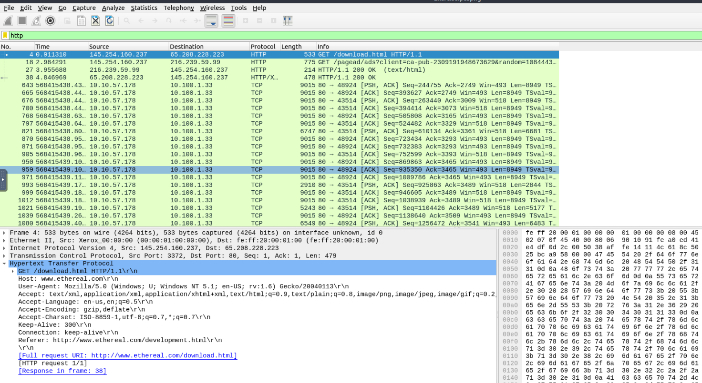

Ans: http

**Q16** What is the number of displayed packets?

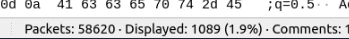

Ans: 1089

**Q17** Go to packet number 33790, follow the HTTP stream, and look carefully at the responses.
Looking at the web server's response, what is the total number of artists?

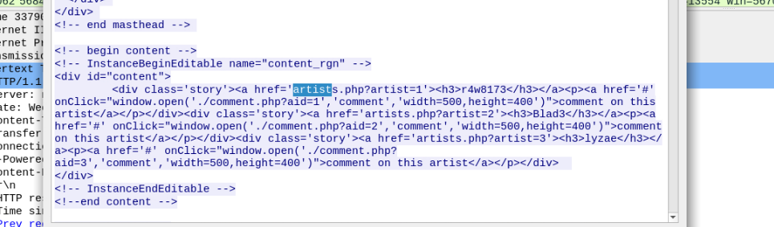

Ans: 3

**Q18** What is the name of the second artist?

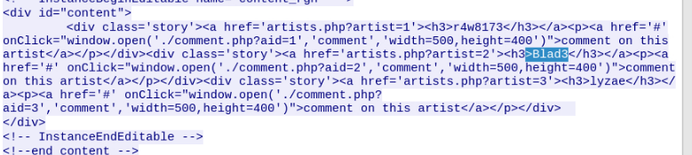

Ans: Blad3
